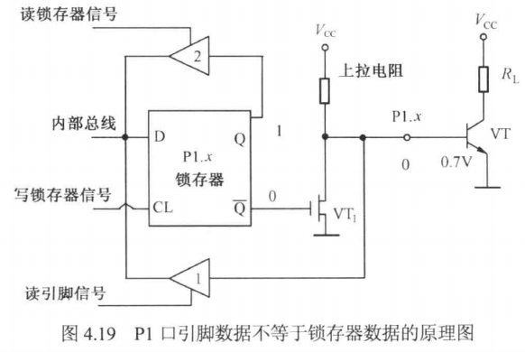
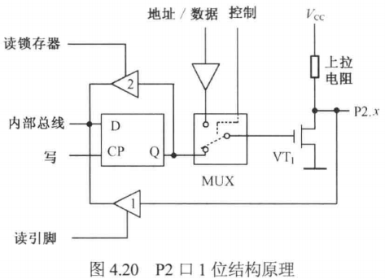
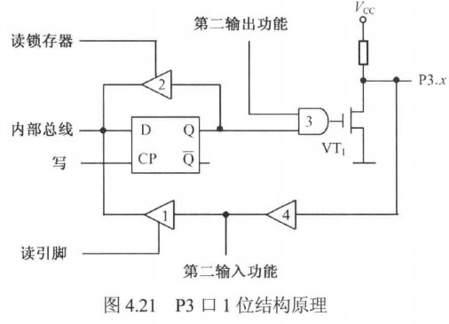
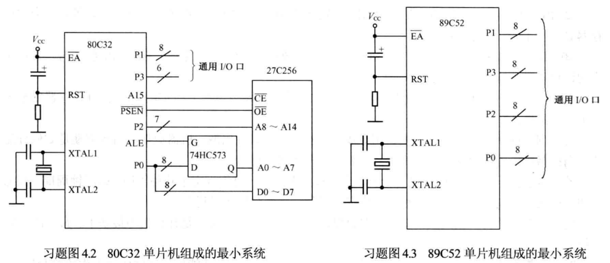
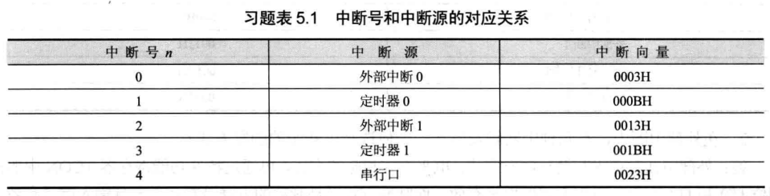
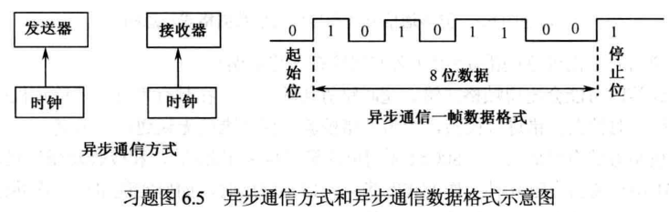
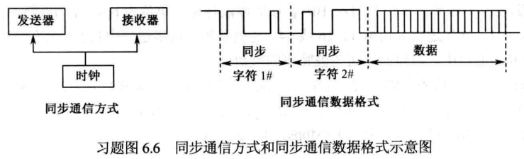
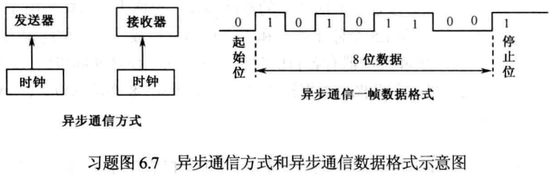

# 单片机大题(50分)考试范围及答案

## 一、$P_8$ - $T_{2、4}$

### a. 简述单片机的基本含义及应用领域

**答：**  
如果在一块芯片上，集成了一台微型计算机的4个基本组成部分，这种芯片就被称为单片微型计算机（Single Chip Microcomputer），简称单片机。也就是说，单片机是一块芯片上的微型计算机。

单片机由于其体积小、功耗低、价格低廉，且具有逻辑判断、定时计数、程序控制等多种功能，广泛应用于仪器仪表、家用电器、医疗设备、航空航天、专用设备的智能化管理及过程控制等领域。

**下面简单介绍一些典型的应用：**

1. **单片机在智能仪表中的应用**  
   单片机具有体积小、功耗低、控制功能强、扩展灵活、微型化和使用方便等优点，被广泛应用于仪器仪表中。结合不同类型的传感器，可实现诸如电压、功率、频率、湿度、温度、流量、速度、厚度、角度、长度、硬度、压力等物理量的测量。采用单片机控制，使得仪器仪表数字化、智能化、微型化，且功能比起采用电子或数字电路更加强大，提高了其性能价格比，如精密的测量设备（功率计、示波器、各种分析仪）。

2. **单片机在机电一体化中的应用**  
   机电一体化是机械工业发展的方向。机电一体化产品是指集机械技术、微电子技术、计算机技术、传感器技术于一体，具有智能化特征的机电产品，如微机控制的车床、钻床等。单片机作为产品中的控制器，能充分发挥其体积小、可靠性高、功能强等优点，可大大提高机器的自动化、智能化程度。可编程顺序控制器也是一个典型的机电控制器，其核心常常就是由一个单片机构成的。

3. **单片机在实时控制中的应用**  
   单片机广泛地应用于各种实时控制系统中。例如，在工业测控、航空航天、尖端武器等各种实时控制系统中，都可以使用单片机作为控制器。单片机的实时数据处理能力和控制功能，能使系统保持在最佳工作状态，提高了系统的工作效率和产品质量。再如机器人，每个关节或动作部位都是一个单片机实时控制系统。

4. **单片机在分布式多机系统中的应用**  
   在比较复杂的系统中，常采用分布式多机系统。多机系统一般由若干台功能各异的单片机应用系统组成，各自完成特定的任务，它们通过串行通信相互联系、协调工作。单片机在这种系统中往往作为一个终端机，安装在系统的某些节点上，对现场信息进行实时测量和控制。单片机的高可靠性和强抗干扰能力，使它可以被置于恶劣环境的前端工作。

5. **消费类电子产品控制**  
   该应用主要反映在家电领域，如洗衣机、空调器、汽车电子与保安系统、电视机、录像机、DVD机、音响设备、电子秤、IC卡、手机、BP机等。在这些设备中使用单片机芯片之后，其控制功能和性能大大提高，并实现了智能化、最优化控制。

6. **终端及外部设备控制**  
   在计算机网络终端设备（如银行终端、商业POS自动收款机、复印机等）和计算机外部设备（如打印机、绘图机、传真机、键盘和通信终端等）中使用单片机，使其具有计算、存储、显示、输入等功能，具有和计算机连接的接口，使计算机的能力及应用范围大大提高，可以更好地发挥计算机的性能。

**a. 单片机应用的广泛性**  
可以毫不夸张地说，凡是能想到的地方，单片机都可以用得上。全世界单片机的年产量数以亿计，应用范围之广，花样之多，一时难以详述。单片机应用的意义不仅限于它的广阔应用范围和所带来的经济效益，更重要的还在于其从根本上改变了传统的控制系统设计思想和设计方法。从前，必须由模拟电路或数字电路实现的大部分控制功能，现在可以使用单片机通过软件方法实现。这种以软件代替硬件并能提高系统性能的控制技术称为微控制技术。微控制技术是一种全新概念，随着单片机应用的推广普及，微控制技术必将不断发展和日趋完善，而单片机的应用必将更加深入、更加广泛。

**b. 单片机技术的特点与意义**  
单片机与常用的TTL、CMOS数字集成电路相比，掌握起来不太容易，问题在于单片机具有智能化功能，不仅要学习其硬件的使用方法，还要学习其软件的使用方法，而软件设计需要有一定的创造性。这虽然给学习者带来一定难度，但这也正是它的迷人之处。一个普通的消毒碗柜上装有专用软件的单片机，虽然成本增加了10余元，但市场售价可高出300余元。理由何在？原因在于它的技术含量高，其中的软件凝聚着开发者的聪明和智慧。

由此可见，单片机技术无疑将是21世纪最为活跃的新一代电子应用技术。随着微控制技术（以软件代替硬件的高性能控制技术）的发展，单片机的应用必将导致传统控制技术发生巨大变革。换言之，单片机的应用是对传统控制技术的一场革命。因此，学习单片机的原理，掌握单片机应用系统设计技术，具有划时代的意义。

---

### b. 单片机的分类及主要指标是什么？

**答：**  
单片机从机器字长（即数据总线宽度）上可以分为4位机、8位机、16位机、32位机和64位机，从用途上可分成专用型单片机和通用型单片机两大类。

**主要指标：**  
位数、存储器、I/O口、速度、工作电压、功耗、温度、附加功能。

---

## 二、$P_{33}$ - $T_{15}$

### a. 什么是 RAM？什么是 ROM？试区分其性能和用途

**答：**  
**RAM（Random Access Memory）** 是随机访问存储器。RAM存储器是断电时信息会丢失的存储器，但是这种存储器可以现场快速地修改信息，所以RAM存储器是可读/写存储器，一般作为数据存储器使用，用来存放现场输入的数据，或者存放可以更改的运行程序和数据。

**ROM（Read Only Memory）** 是只读存储器。ROM存储器的特点是：其内容是预先写入的，而且一旦写入，使用时就只能读出不能改变，掉电时也不会丢失，通常用于存储程序或常数。

---

## 三、$P_{98}$ - $T_{1、3、4、6、7、8、10、12、13、15}$

### a. 结合MCS-51系列单片机功能框图阐明其大致组成


**答：**  
MCS-51系列单片机内部组成如习题图4.1所示。主要有8031、8051、8751这3种机型，基于HMOS工艺，它们的指令系统与芯片引脚完全兼容，只是片内程序存储器（ROM, Read Only Memory）有所不同。

其主要组成如下：

- 8位CPU；
- 片内带振荡器及时钟电路；
- 128B片内数据存储器；
- 4KB片内程序存储器（8031/80C31无）；
- 程序存储器的寻址范围为64KB；
- 片外数据存储器的寻址范围为64KB；
- 21B特殊功能寄存器；
- 4×8根I/O线；
- 1个全双工串行I/O接口，可多机通信；
- 两个16位定时器/计数器；
- 中断系统有5个中断源，可编程为两个优先级；
- 111条指令，含乘法指令和除法指令；
- 布尔处理器；
- 使用单+5V电源。

---

### b. 80C51单片机内部包含哪些主要逻辑功能部件？各有什么主要功能？

**答：**  
80C51单片机内部包含带有布尔（位）处理器的中央处理器、数据存储器和程序存储器、并行输入输出端口、中断系统、定时器/计数器，以及串行口、时钟电路、复位电路。（详见主教材4.3。）

---

### c. 什么是ALU？简述MCS-51系列单片机ALU的功能与特点

**答：**  
ALU是用于对数据进行算术运算和逻辑操作的执行部件，由加法器和其他逻辑电路（移位电路和判断电路等）组成。在控制信号的作用下，它能完成算术加、减、乘、除和逻辑与、或、异或等运算，以及循环移位操作、位操作等功能。

---

### d. 什么是指令？什么是程序？简述程序在计算机中的执行过程

**答：**  
指令由操作码和操作数构成，分别表示何种操作和操作数的存储地址。程序是可以连续执行，并能够完成一定任务的一条条指令的集合。

程序执行是由控制器控制的，控制器是CPU的中枢，它包括定时控制逻辑、指令寄存器IR、数据指针DPTR及程序计数器PC、堆栈指针SP、地址寄存器、地址缓冲器等。它的功能是对程序的逐条指令进行译码，并通过定时和控制电路在规定的时刻发出各种操作所需的内部和外部控制信号，协调各部分的工作，完成指令规定的操作。

---

### e. 什么是堆栈？堆栈有何作用？在程序设计时，有时为什么要对堆栈指针SP重新赋值？如果CPU在操作中要使用两组工作寄存器，你认为SP的初值应为多大？

**答：**  
堆栈是个特殊的存储区，主要功能是暂时存放数据和地址，通常用来保护断点和现场。它的特点是按照先进后出的原则存取数据，这里的进与出是指进栈与出栈操作。

80C51片内RAM的部分单元可以用作堆栈。有一个8位的堆栈指针寄存器SP，专用于指出当前堆栈顶部是片内RAM的哪个单元。80C51单片机系统复位后SP的初值为07H，也就是将从内部RAM的08H单元开始堆放信息。但是，80C51系列的栈区不是固定的，只要通过软件改变SP寄存器的值便可更动栈区。为了避开工作寄存器区和位寻址区，SP的初值可置为2FH或更大的地址值。

如果CPU在操作中，则要使用两组工作寄存器。如果不使用位变量，则SP的初值至少应为0FH或更大的值；如果使用位变量，SP的初值至少应为2FH或更大的值。Keil C51编译器会自动计算SP的初始设定值，无须编程者关心。

---

### f. 程序状态寄存器PSW的作用是什么？常用状态标志位有哪几位？作用是什么？

| 地址 | D7H | D6H | D5H | D4H | D3H | D2H | D1H | D0H |
|------|-----|-----|-----|-----|-----|-----|-----|-----|
| 名称 | C   | AC  | F0  | RS1 | RS0 | OV  | F1  | P   |

**答：**  
PSW是8位寄存器，用作程序运行状态的标志。PSW寄存器各位名称及地址如上表。

当CPU执行各种逻辑操作或算术运算时，为反映操作或运算结果的状态，把相应的标志位置位或清零。这些标志的状态，可由专门的指令来测试，也可通过指令读出。它为计算机确定程序的下一步运行方向提供依据。

PSW寄存器中各标志位的作用如下：

- **P：奇偶标志。** 该位始终跟踪累加器A的内容的奇偶性。如果有奇数个1，则置P为1，否则清零。在80C51的指令系统中，凡是改变累加器A中内容的指令均影响奇偶标志位P。
- **F1：用户标志位。** 由用户置位或复位。
- **OV：溢出标志。** 有符号数运算时，如果发生溢出，OV置1，否则清零。对于1B的有符号数，如果用最高位表示正、负号，则只有7位有效位，能表示-128～+127之间的数。如果运算结果超出了这个数值范围，就会发生溢出，此时，OV=1，否则OV=0。在乘法运算中，OV=1表示乘积超过255；在除法运算中，OV=1表示除数为0。
- **RS0、RS1：工作寄存器组选择位。** 用于选择指令当前工作的寄存器组。由用户用软件改变RS0和RS1的组合，以切换当前选用的工作寄存器组，单片机在复位后，RS0=RS1=0，CPU自然选中第0组为当前工作寄存器组。根据需要，用户可利用传送指令或位操作指令来改变其状态，这样的设置为程序中快速保护现场提供了方便。
- **F0：用户标志位，** 同F1。
- **AC：半进位标志位。** 当进行加法（或减法）运算时，如果低半字节（位3）向高半字节（位4）有进位（或借位），AC置1，否则清零。AC也可用于BCD码调整时的判别位。
- **CY：进位标志位。** 在进行加法（或减法）运算时，如果操作结果最高位（位7）有进位，CY置1，否则清零。在进行位操作累加器C。

---

### g. 综述P0、P1、P2和P3口各有哪几种功能？

具体内容参见教材4.3.3节$P_{85}$ ~ $P_{88}$。
单片机的P0、P1、P2和P3口是并行输入输出端口，它们的功能因单片机型号而异。以常见的80C51单片机为例，这些端口的功能如下(由AI总结)：

### P0口（Port 0）

- **基本功能**：P0口是一个8位双向I/O端口，用于数据传输。
- **其他功能**：
  - **地址/数据总线复用**：在访问外部存储器时，P0口用于输出低8位地址（A0-A7）和数据（D0-D7）。在访问外部存储器时，P0口需要通过地址锁存器（如74LS373）将地址和数据分离。
  - **外部设备控制**：可以用于控制外部设备的输入输出操作。
  - **多用途功能**：在某些应用中，P0口可以配置为通用I/O口，用于读取或输出数据。


### P1口（Port 1）

- **基本功能**：P1口是一个8位双向I/O端口，通常用于通用输入输出操作。
- **其他功能**：
  - **扩展功能**：在某些应用中，P1口可以用于扩展外部设备，如连接键盘、显示器等。
  - **中断控制**：某些单片机型号中，P1口的某些引脚可以配置为中断输入引脚。
  - **通信功能**：在某些通信协议中，P1口可以用于实现简单的串行通信或并行通信。




### P2口（Port 2）

- **基本功能**：P2口是一个8位双向I/O端口，通常用于地址和数据传输。
- **其他功能**：
  - **地址总线**：在访问外部存储器时，P2口用于输出高8位地址（A8-A15）。与P0口配合，可以访问64KB的外部存储器空间。
  - **外部设备控制**：可以用于控制外部设备的输入输出操作。
  - **多用途功能**：在某些应用中，P2口可以配置为通用I/O口，用于读取或输出数据。



### P3口（Port 3）

- **基本功能**：P3口是一个8位双向I/O端口，通常用于多种特殊功能。
- **其他功能**：
  - **串行通信**：P3.0和P3.1通常用于串行通信（RXD和TXD），用于接收和发送串行数据。
  - **外部中断**：P3.2和P3.3通常用于外部中断输入（INT0和INT1）。
  - **定时器控制**：P3.4和P3.5通常用于定时器的输入输出（T0和T1）。
  - **读写控制**：P3.6和P3.7通常用于读写控制（RD和WR），用于访问外部存储器或I/O设备。
  - **多用途功能**：在某些应用中，P3口的某些引脚也可以配置为通用I/O口，用于读取或输出数据。




### 总结

- **P0口**：主要用于地址/数据总线复用，也可用于通用I/O。
- **P1口**：主要用于通用I/O，也可用于扩展功能和中断控制。
- **P2口**：主要用于高8位地址输出，也可用于通用I/O。
- **P3口**：主要用于特殊功能（如串行通信、外部中断、定时器控制、读写控制等），也可用于通用I/O。

---

### h. 何谓时钟周期、机器周期、指令周期？80C51的时钟周期、机器周期、指令周期是如何分配的？当振荡频率为8MHz时，一个单片机机器周期为多少微秒？

**答：**  
为了便于对CPU时序进行分析，人们按指令的执行过程规定了几种周期，即时钟周期、状态周期、机器周期和指令周期，也称为时序定时单位，下面分别予以说明。

- **时钟周期** 也称为振荡周期，定义为时钟脉冲频率（$f_{osc}$）的倒数，是计算机中最基本、最小的时间单位。
- **时钟周期经2分频后成为内部的时钟信号**，用作单片机内部各功能部件按序协调工作的控制信号，称为状态周期，用S表示。这样一个状态周期就有两个时钟周期，前半状态周期相应的时钟周期定义为P1，后半周期对应的节拍定义为P2。
- **完成一个基本操作所需要的时间称为机器周期**，也称CPU周期。80C51有固定的机器周期，规定一个机器周期有6个状态，分别表示为S1～S6，而一个状态包含两个时钟周期，那么一个机器周期就有12个时钟周期。

所以当振荡频率为8MHz时，机器周期为：$12 \times \frac{1}{8\text{MHz}} = 12 \times 0.125\mu s = 1.5\mu s$。

---

### i. 复位的作用是什么？有几种复位方法？复位后单片机的状态如何？

**答：**  
复位是单片机的初始化操作。单片机系统在上电启动运行前，都需要先复位，其作用是使CPU和系统中其他部件都处于一个确定的初始状态，并从这个状态开始工作。

单片机的外部复位电路有上电自动复位和按键手动复位两种。

当80C51通电，时钟电路开始工作，在80C51单片机的RST（DIP40封装第9脚）引脚加上大于24个时钟周期以上的正脉冲，80C51单片机系统即初始复位。初始化后，程序计数器PC指向0000H，P0～P3输出口全部为高电平，堆栈指针写入07H，其他专用寄存器被清零。RST由高电平下降为低电平后，系统从0000H地址开始执行程序。

---

### j. 何谓单片机最小系统？请分别画出由80C32单片机和89C52单片机组成的最小系统



**答：**  
单片机最小系统就是能使单片机工作的最少的器件构成的系统，是大多数控制系统必不可少的关键部分。80C32单片机和89C52单片机组成的最小系统如习题图4.2和习题图4.3所示。

---

## 四、$P_{153}$ - $T_{3、4、7、11、15、17、20、21、26}$

### a. 何为寻址方式？80C51单片机有哪些寻址方式？

**答：**  
80C51单片机共有7种寻址方式。

- 寄存器寻址
- 寄存器间接寻址
- 直接寻址
- 立即寻址
- 基址寄存器+变址寄存器的间接寻址
- 相对寻址
- 位寻址

---

### b. 什么是源操作数？什么是目的操作数？通常在指令中如何加以区分？

**答：**  
在双操作数的指令中，指令执行后的结果放在其中的一个操作数中，这个操作数是目的操作数，另外一个是源操作数。80C51指令系统中，不靠近指令操作码的是源操作数，源操作数可以是立即数。80C51指令系统中，紧跟在指令操作码之后是目的操作数，算术运算和大多数逻辑运算其目的操作数必须是累加器A，目的操作数不允许使用立即数寻址方式。

---

### c. 写出完成下列要求的C语言程序

#### （1）将地址为4000H的片外数据存储单元内容，送入地址为30H的片内数据存储单元中

**答：**  
可使用绝对地址访问函数实现：

```c
DBYTE[0x30] = XBYTE[0x4000];
```

#### （2）将地址为4000H的片外数据存储单元内容，送入地址为3000H的片外数据存储单元中

**答：**  
可使用绝对地址访问函数实现：

```c
XBYTE[0x3000] = XBYTE[0x4000];
```

#### （3）将地址为080H的程序存储单元内容，送入地址为30H的片内数据存储单元中

**答：**  
可使用绝对地址访问函数实现：

```c
DBYTE[0x30] = CBYTE[0x0800];
```

#### （4）将片内数据存储器中地址为30H与40H的单元内容交换

**答：**  
此题答案不唯一，也可用指针运算或其他方案实现：

```c
unsigned char temp;
temp = DBYTE[0x40];
DBYTE[0x40] = DBYTE[0x30];
DBYTE[0x30] = temp;
```

#### （5）将片内数据存储器中地址为30H单元的低4位与高4位交换

**答：**  
使用C51提供的本征函数`_cror_`实现：

```c
#include <intrins.h>
_cror_(DBYTE[0x30], 4);
```

---

### d. 已知：(30H)= 55H, (31H)= 0AAH, 分别写出完成下列要求的指令，并写出32H单元的内容

**答：**

（1）`(30H)&(31H)→(32H);`  

```c
DBYTE[0x32] = DBYTE[0x30] & DBYTE[0x31];
```

结果：`(32H) = 0x00`

（2）`(30H)|(31H)→(32H);`  

```c
DBYTE[0x32] = DBYTE[0x30] | DBYTE[0x31];
```

结果：`(32H) = 0xFF`

（3）`(30H)^(31H)→(32H);`  

```c
DBYTE[0x32] = DBYTE[0x30] ^ DBYTE[0x31];
```

结果：`(32H) = 0xFF`

---

### e

设堆栈指针(SP)= 60H

(1) 2500H    LCALL L00  
...  
(2) 2700H    MOV  A, #03H  
...  
(3) 2750H    RET  

执行（1）指令后：(SP)、((SP))、((SP-1))、(PC) 各为多少？执行（2）指令后：(SP)、(PC)为多少？若将（1）指令改为ACALL L00，标号L00的取值范围是多少？

**答：**  
执行（1）指令后，(SP)=62H，((SP))=25H，((SP-1))=03H，(PC)= L00。

执行（2）指令后，(SP)=60H，(PC)=2702H。

若将（1）指令改为ACALL L00，标号L00的取值范围是当前PC的高5位，加上低11位从全0变全1；例如，2500H ACALL L00，当前PC=2500H，PC高5位是00100，则L00取值范围是：`[00100, 00000000000000～00100, 11111111111]`

---

### f. 有程序如下

```c
CLR C
CLR RS1
CLR RS0
MOV A, #38H
MOV R0, A
MOV 29H, R0
SETB RS0

MOV R1, A
MOV 26H, A
MOV 28H, C
```

#### （1）区分哪些是伪操作指令？哪些是字节操作指令？

| 指令          | 类型        |
|---------------|-------------|
| CLR C;        | 位操作指令  |
| CLR RS1;      | 位操作指令  |
| CLR RS0;      | 位操作指令  |
| MOV A, #38H;  | 字节操作指令|
| MOV R0, A;    | 字节操作指令|
| MOV 29H, R0;  | 字节操作指令|
| SETB RS0;     | 位操作指令  |
| MOV R1, A;    | 字节操作指令|
| MOV 26H, A;   | 字节操作指令|
| MOV 28H, C;   | 位操作指令  |

#### （2）写出程序执行后，片内RAM有关单元的内容

| 指令 | 执行结果 |
|------|----------|
| CLR C; | (C)=0   |
| CLR RS1; | (RS1)=0 |
| CLR RS0; | (RS0)=0 |
| MOV A, #38H; | A=38H   |
| MOV R0, A; | R0=(A)=38H |
| MOV 29H, R0; | (29H)=(R0)=38H |
| SETB RS0; | (RS0)=1 |
| MOV R1, A; | R1=(A)=38H |
| MOV 26H, A; | (26H)=(A)=38H |
| MOV 28H, C; | (28H)=(C)=0 |

#### （3）如$f_{osc}$ = 12MHz，计算这段程序的执行时间

**答：**  
如$f_{osc}$ = 12MHz，这段程序的执行时间=11μs。

---

### g. 伪指令与汇编指令有何区别？说出常用的5种伪指令的作用

**答：**  

- **汇编指令**：编译后产生机器码的指令。
- **伪指令**：仅供汇编程序使用，编译后不产生机器码的指令。

常用的5种伪指令如下：

1. **设置起始地址 ORG（Origin）**  
   指令格式：`ORG nn`  
   作用：将ORG nn后的程序机器码或数据存放在以nn为首地址的存储单元中。例如伪指令`ORG 1000H`，是将目标程序从地址1000H处开始存放。

2. **定义字节 DB 或 DEFB（Define Byte）**  
   指令格式：`[LABEL] DB N1, N2, …, Nm`  
   作用：将DB后的8位字节数据N1, N2, …, Nm依次存入以标号LABEL为首地址的存储单元中。若无标号，则N1, N2, …, Nm依次存放在DB上一条指令之后的存储单元中。

3. **定义字 DW 或 DEFW（Define Word）**  
   指令格式：`[LABEL] DW NN1, NN2, …, NNm`  
   作用：将DW后的16位字数据NN1, NN2, …, NNm依次存放到以标号LABEL为首地址的存储单元中。若无标号，则NN1, NN2, …, NNm依次存放在DW上一条指令之后的存储单元中。

4. **为标号赋值 EQU（Equate）**  
   指令格式：`LABEL EQU nn（或n）`  
   作用：将16位地址nn（或8位地址n）赋给标号LABEL。

5. **结束汇编 END**  
   指令格式：`END`  
   作用：汇编程序编译源程序时，遇到伪指令END，不管其后是否还有其他指令都将停止编译。

---

### h. 在单片机应用开发系统中，C语言编程与汇编语言编程相比有哪些优势？

**答：**  
汇编语言有执行效率高的优点，但其可移植性和可读性差，并且它本身就是一种编程效率低的低级语言，这些都使它的编程和维护极不方便，从而导致了整个系统的可靠性也较差。而使用C语言进行单片机应用系统的开发，有着汇编语言编程不可比拟的优势。

1. 编程调试灵活方便
2. 生成的代码编译效率高
3. 完全模块化
4. 可移植性好
5. 便于项目维护管理

---

### i. 如何定义C51的中断函数？



**答：**  
80C51的中断系统十分重要，C51编译器允许在C语言源程序中声明中断和编写中断服务程序，从而减轻了采用汇编程序编写中断服务程序的烦琐程度。通过使用`interrupt`关键字来实现。定义中断服务程序的一般格式如下：

```c
void 函数名() interrupt n [using m]
```

- 关键字`interrupt`后面的`n`是中断号，`n`的取值范围为0～31。编译程序从`8n+3`处产生中断向量，即在程序存储器`8n+3`地址处形成一条长跳转指令，转向中断号`n`的中断服务程序。中断号对应着IE寄存器中的使能位，换句话说IE寄存器中的0位对应着外部中断0，相应的外部中断0的中断号是0。中断号0～4对应中断源的关系如习题表5.1所示。
- `using m`指明该中断服务程序所对应的工作寄存器组，取值范围为0～3。指定工作寄存器组的缺点是所有被中断调用的过程都必须使用同一个寄存器组，否则参数传递会发生错误。通常不设定`using m`，除非保证中断程序中未调用其他子程序。

设置一个定时器中断服务程序的例子如下：

```c
#include <reg51.h>
#include <stdio.h>
#define RELOADTH 0x3C
#define RELOADTL 0xB0
extern unsigned int time0_counter;

void timer0(void) interrupt 1 {
    TR0 = 0;    /* 停止定时器0 */
    TH0 = RELOADTH;    /* 50ms 后溢出 */
    TL0 = RELOADTL;
    TR0 = 1;    /* 启动 T0 */
    time0_counter++;    /* 中断次数计数器加 1 */
    printf("time0_counter=%05d\n", time0_counter);
}
```

使用C51编写中断服务程序，程序员无须关心ACC、B、DPH、DPL、PSW等寄存器的保护，C51编译器会根据上述寄存器的使用情况在目标代码中自动增加压栈和出栈。

---

## 五、$P_{201}$ - $T_{1、3、4、6、8、11、12、13、16、19}$

### a. 80C51有几个中断源，各中断标志是如何产生、如何复0的？CPU响应中断时，其中断入口地址各是多少？

**答：**  
80C51共有3类5个中断源，分别是2个外部中断源、2个定时中断源、1个串行口接收/发送中断源。

要实现中断，首先中断源要提出中断请求，单片机内中断请求的过程是特殊功能寄存器TCON和SCON相关状态位——中断请求标志位置1的过程，当CPU响应中断时，中断请求标志位才由硬件或软件清零。

---

### b. 80C51提供哪几种中断？在中断管理上有何特点？什么是同级内的优先权管理？中断被封锁的条件有哪些？

  


**答：**  
80C51共有3类5个中断源，分别是2个外部中断源、2个定时中断源、1个串行口接收/发送中断源。中断管理是通过设置中断允许控制寄存器IE和中断优先级寄存器IP完成的。

- **中断控制为两级控制**：以EA实现中断总控，以各中断源的中断允许位实现分控。当总控制位为禁止时，不管分控位状态如何，整个中断系统被禁止。只有当总控制位为允许状态时，中断的允许与禁止才能由各分控制位决定。
- **80C51有两个中断优先级**，每个中断源均可通过软件设置为高优先级或低优先级中断，实现2级中断嵌套。高优先级中断请求可以中断一个正在执行的低优先级中断服务，除非正在执行的低优先级中断服务程序设置了禁止某些高优先级的中断。正在执行的中断服务程序不能被另一个同级或低优先级的中断所中断；正在执行高优先级的中断服务程序，不能被任何中断源中断。一直执行到返回指令RETI，返回主程序，而后再执行一条指令后，才能响应新的中断申请。
- **同级内的优先权管理**：当同一优先级的几个中断源同时向CPU提出中断请求时，CPU通过内部硬件查询逻辑电路，按查询顺序判定优先响应哪一个中断请求，其查询顺序为：外部中断0、定时中断0、外部中断1、定时中断1、串行中断。

**中断被封锁的条件：**

1. CPU正在处理同级的或更高优先级的中断。
2. 当前的机器周期不是所执行指令的最后一个机器周期，即在当前指令完成之前，CPU不会响应任何中断请求。
3. 正在执行的指令是RETI或访问IE或IP的指令。CPU完成这类指令后，至少还要再执行一条指令才会响应新的中断请求，以便保证程序能够正确地返回。

---

### c. 在中断请求有效并开中断状况下，能否保证立即响应中断？有什么条件？

**答：**  
不能保证立即响应中断。条件是不出现下列情况：

1. CPU正在处理同级的或更高优先级的中断。
2. 当前的机器周期不是所执行指令的最后一个机器周期，即在当前指令完成之前，CPU不会响应任何中断请求。
3. 正在执行的指令是RETI或访问IE或IP的指令。CPU完成这类指令后，至少还要再执行一条指令才会响应新的中断请求，以便保证程序能够正确地返回。

---

### d. 80C51单片机内部设有几个定时器/计数器？它们各由哪些特殊功能寄存器所组成？有哪几种工作方式？

**答：**  
80C51的单片机内有2个16位可编程的定时器/计数器，它们具有4种工作方式，其控制字和状态均在相应的特殊功能寄存器中，通过对控制寄存器的编程就可以方便地选择适当的工作方式。

- **特殊功能寄存器**：
  - 16位加1计数器：TH0、TL0 和 TH1、TL1。
  - 定时控制寄存器（TCON）和工作方式控制寄存器（TMOD）。

- **工作方式**：
  1. 工作方式0：13位定时器/计数器。
  2. 工作方式1：16位定时器/计数器。
  3. 工作方式2：初值自动重新装入的8位定时器/计数器。
  4. 工作方式3：仅适用于T0，将其分为两个8位计数器。对T1停止计数。

---

### e. 定时器/计数器用于定时，定时时间与哪些因素有关？用于计数，对外来计数频率有何限制？


**答：**  
当80C51内部的定时器/计数器被选定为定时器工作模式时，计数输入信号是内部时钟脉冲，每个机器周期产生一个脉冲位，计数器增1，因此定时器/计数器的输入脉冲的周期与机器周期一样，为时钟振荡频率的1/12。当采用12MHz频率的晶体时，计数速率为1MHz，输入脉冲的周期间隔为1μs。由于定时的精度决定于输入脉冲的周期，因此当需要高分辨率的定时，应尽量选用频率较高的晶振（80C51最高为40MHz）。

当定时器/计数器用作计数器时，计数脉冲来自外部输入引脚T0或T1。当输入信号产生由1至0的跳变（即负跳变）时，计数器的值增1。每个机器周期的S5P2期间，对外部输入进行采样。如在第一个周期中采样的值为1，而在下一个周期中采样的值为0，则在紧跟着的再下一个周期S3P1的期间，计数器加1。由于确认一次下跳变需要花2个机器周期，即24个振荡周期，因此外部输入的计数脉冲的最高频率为振荡器频率的1/24。例如，选用6MHz频率的晶体，允许输入的脉冲频率为250kHz，如果选用12MHz频率的晶体，则可输入500kHz的外部脉冲。对于外部输入信号的占空比并没有什么限制，但为了确保某一给定的电平在变化之前能被采样一次，则这个电平至少要保持一个机器周期。定时输入信号的基本要求如习题图6.2所示，图中$T_{cy}$为机器周期。

---

### f. 80C51单片机系统中，已知单片机晶振频率为6MHz，选用定时器0以工作方式3产生周期为400μs的等宽正方波连续脉冲，请编写由P1.1口输出此方波的程序

```c
#include "REG51.H"
sbit rect_wave = P1^1;

void time_over(void);

void main(void) {
    TMOD = 0x03;  // 设置定时器0为工作方式3
    TL0 = 160;    // 设置定时初值
    IE = 0x00;    // 关闭所有中断
    TR0 = 1;      // 启动定时器0
    for(;;) {
        if(TF0) time_over();  // 检测定时器0溢出
    }
}

void time_over(void) {
    TF0 = 0;      // 清除定时器0溢出标志
    TL0 = 160;    // 重新加载定时初值
    rect_wave = !rect_wave;  // 取反P1.1口的电平
}
```

---

### g. 串行通信操作模式有哪几种？各有什么特点？

  


**答：**  
串行通信操作模式有两种，异步串行通信和同步串行通信。

1. **异步串行通信**：
   - 数据格式由1个起始位、7个或8个数据位、1～2个停止位（含1.5个停止位）和1个校验位组成。
   - 起始位约定为0，空闲位约定为1。
   - 接收器和发送器有各自的时钟，工作是非同步的。
   - 适用于数据的随机发送/接收，传输速度较慢，一般适用于每秒50～19200bps。

2. **同步串行通信**：
   - 发送器和接收器由同一个时钟源控制。
   - 去掉了起始位和停止位，只在传输数据块时先送一个同步头（字符）标志。
   - 适用于成批数据传送，传输速度较快，可达每秒80万bps。
   - 设备复杂，需要一个时钟来协调收发器的工作。

---

### h. 异步串行通信时，通信双方应遵守哪些协定？1帧信息包含哪些内容？



**答：**  
异步串行通信时，通信双方应遵守以下协定：

1. 数据格式必须一致（包括数据位数、停止位数、校验位等）。
2. 波特率必须一致。
3. 起始位和停止位的电平约定必须一致。

1帧信息包含以下内容：

- 1个起始位（0）
- 7个或8个数据位
- 1个校验位（可选）
- 1～2个停止位（1或1.5或2）

---

### i. 什么是波特率？如何计算和设置80C51串行通信的波特率


**答：**  
波特率是串行通信中一个重要概念。波特率BR是单位时间传输的数据位数，单位为bps（bit per second），1bps=1bit/s。波特率的倒数即为每位传输所需的时间。通信双方必须具有相同的波特率，否则无法成功完成数据通信。

波特率的计算公式如下：

1. **工作方式0**：波特率是固定的，为单片机晶振频率的1/12，即：

   $$
   BR = \frac{f_{osc}}{12}
   $$

   例如，当$f_{osc}$ = 6MHz时，波特率为500kbps；当$f_{osc}$ = 12MHz时，波特率为1Mbps。

2. **工作方式2**：波特率也是固定的，且有两种：

   $$
   BR = 2^{SMOD} \times \frac{f_{osc}}{64}
   $$

   其中，SMOD为PCON寄存器最高位的值，SMOD=1表示波特率加倍。

3. **工作方式1和工作方式3**：波特率是可变的，由定时器1的计数溢出决定，公式为：

   $$
   BR = \frac{(2^{SMOD} \times T_d)}{32}
   $$

   定时器1溢出率计算公式为：

   $$
   T = \frac{f_{osc}}{12 \times (256 - TH1)}
   $$

   使用定时器2为波特率发生器工作方式时，其计算公式为：

   $$
   BR = \frac{f_{osc}}{32 \times [65536 - (RCAP2H, RCAP2L)]}
   $$

---

### j. 80C51单片机内部串行口工作于工作方式1、3时，波特率与T1的溢出率有关，什么是T1的溢出率？如何计算定时器T1工作于工作方式1时的T1溢出率？

**答：**  
作为波特率发射器时钟时，计数器应工作在工作方式2。8位计数器自动重装，计数器计满时（最后一个计数状态255），再来一个脉冲，会产生一个溢出信号，计数器复位至第一个状态（第一个计数状态0），从0～255这是满量程计数的情况。如果不满足，则需要设置初值，如设置初值为256-100=156，则计数器输入100个脉冲就会产生溢出信号。对T1而言，单位时间的溢出次数即T1的溢出率。

工作方式1和工作方式3的波特率是可变的，其波特率由定时器1的计数溢出决定，公式为：

$$
BR = \frac{(2^{SMOD} \times T_d)}{32}
$$

定时器1溢出率计算公式为：

$$
T = \frac{f_{osc}}{12 \times (256 - TH1)}
$$
